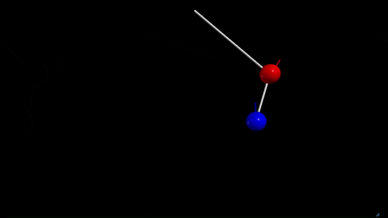

---

### Example 1: Variation in the local Electric field around two moving positively charged spheres  

  

---

### Example 2: Simulation of chaos from a double pendulum  

  

---

### Example 3: Collision of two blocks to calculate π  

  

---
