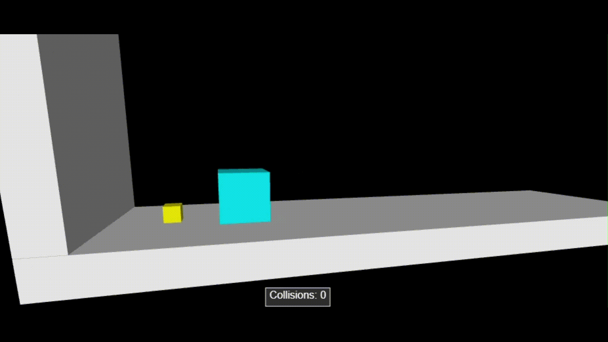

# Computational Physics simulations and problem solving using Python
This repository documents my long-overdue journey into the self-driven exploration of computational physics, using interactive visualizations to build deeper intuition for physical phenomena, which is something that's often overlooked or easy to miss when learning solely through traditional textbooks.

## Why am I building this?
I have always harbored a keen fascination for how the universe works, not just in abstract mathematical terms, but in how physical principles quietly govern everyday events. Whether it's the parabolic arc of a tennis ball hit with a lot of topspin or the newspaper boy tossing the newspaper with the perfect force to land just at my neighbour's door, I often find myself trying to imagine these situations with the physics I have learned mentally.

This project is a way to bring those mental simulations to life. It is driven by a personal need to visualize, to see equations in motion (literally), and to experience the thrill when a few lines of Python code recreate how a satellite orbits the Earth, simply because nature deems it to behave that way.

Along the way, this repository also helps me build stronger physical intuition, understand the limitations and power of numerical methods, and develop clean scientific programming skills that will serve me in research. But at its core, it exists to nurture that joy of seeing physics unfold.

## Packages and usage
Most files in this repository are written from scratch using the [VPython](https://vpython.org/) library in Python 3.11.4. The latest versions of VPython are compatible with Python 3.8 through 3.12.

If you are using a different Python version, consider creating a [virtual environment](https://docs.python.org/3/library/venv.html) with a supported version to ensure compatibility.

Additionally, you can use [Web VPython](https://vpython.org/presentation2018/noinstall.html) or install the VPython library and run it on a code editor of your choice. Furthermore, should you need it, you can access the VPython documentation [here](https://glowscript.org/docs/VPythonDocs/index.html).

To run all programs that involve a 3D simulation, you must have the ```tools.py``` file imported from its location on your machine.

To install the VPython package, run the following command:
```bash
pip install vpython
```
That's almost everything you need to run the files in this repository. Some files also utilize Numpy and/or Scipy; therefore, it may be helpful to have them installed in your environment as well, specifically in the ```taylor-computer-solutions``` directory, which contains solutions to many computer-based problems from Classical Mechanics by John R. Taylor (2005).

## Repository structure
```
Computational-Physics-Projects/
│
├── basic_computational_methods/
│   ├── differentiators.py
│   ├── integrators.py
│   ├── root_finders.md
│   └── root_finders.py
│
├── basics_of_vpython/
│   ├── button.py
│   ├── checkbox.py
│   ├── graphing.py
│   ├── integration.py
│   ├── monte_carlo_simul.py
│   ├── slider.py
│   └── vectors.py
│
├── classical_mechanics/
│   ├── angular_momentum.py
│   ├── double_pendulum.py
│   ├── orbits.py
│   ├── pi_from_blocks.py
│   └── projectile_motion_with_drag.py
│
├── electromagnetism/
│   └── electric_field.py
│
├── taylor-computer-solutions/
│   └── problem-3-23.py
│
├── README.md
│
├── collisions.gif
│
├── electric_field.gif
│
└── tools.py
```


## Example 1: Variation in the local Electric field around two moving positively charged spheres


## Example 2: Collision of two blocks to represent pi (well known because of 3b1b)

